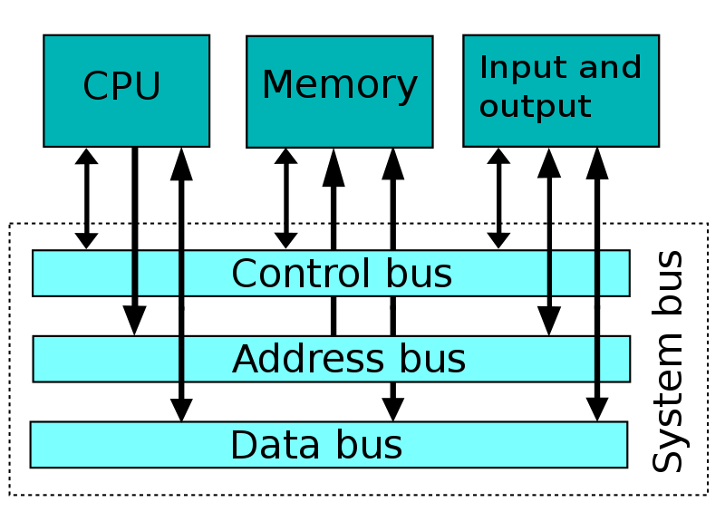

## Содержание дисциплины
- # Раздел 1. Архитектура процессоров


Тема 4. Процесс сборки программ
Карта памяти. Директивы ассемблера. Компиляция, трансляция, компоновка. Загрузка программ.

Ассемблирование кода. Сборка программ. Компиляция и трансляция. Компоновка программ. Загрузка программ в оперативную память.

Самостоятельная работа

Алгоритм работы компоновщика. Оптимизация программ.

## Обращения к памяти
Сохранить значение регистра eax по адресу 0x40100, а потом загрузить обратно в регистр ebx:

    mov %eax, 0x40100
    mov 0x40100, %ebx
(При этом мы используем 4 байта по адресам 0x40100, 0x40101, 0x40102, 0x40103.)

Положить в память по адресу 0x40100 целое число 0x1543:

    movl $0x1543, 0x40100
Как правило, мы используем в качестве адресов метки:
```
    .global main
main:
    mov x, %eax
    call writei32
    call finish

x:  .int 43
```
Не любой адрес в памяти доступен для чтения и тем более записи:
```
    .global main
main:
    incl x
    call finish

x:  .int 43
```
При попытке исполнения инструкции incl операционная система остановит программу с сообщением «Segmentation fault», поскольку эти данные нельзя менять.

## Секции .data и .bss
Любые байты, порождаемые ассемблером, записываются в одну из секций исполняемого файла. По умолчанию это секция .text, в которой ожидается машинный код и которая недоступна для записи.

Данные можно положить в секцию .data:
```
    incl x

    .data
x:  .int 43

    .text
    call finish
```
Обратите внимание, что ассемблер собирает вместе содержимое каждой из секций: в примере выше инструкция call окажется в памяти (и в исполняемом файле) сразу после incl.

Есть также секция .bss, в которую можно положить только нулевые байты:
```
    .bss
z:  .int 0
    .int 0
    // .int 83  // would be an error
```
Typical memory layout:
```
           ┌──────────────────┐    Executable file
0x0000_0000│//////////////////│   ┌───────────────┐
           │//////////////////│   │ headers       │
           ├──────────────────┤   ├───────────────┤
           │.text   (read and │   │.text          │
           │         execute) │   │               │
      eip─►│                  │   │               │
           │                  │   │               │
           │                  │   │               │
           ├──────────────────┤   ├───────────────┤
           │.data   (read and │   │.data          │
           │         write)   │   │               │
           ├──────────────────┤   └───────────────┘
           │.bss    (read and │
           │         write)   │
           │                  │
           ├──────────────────┤
           │//////////////////│
           │//////////////////│    /// = unmapped region
           │//////////////////│          (inaccessible memory)
           │//////////////////│
           │//////////////////│
           │//////////////////│
      esp─►│stack             │
           │                  │
           │                  │
           │                  │
           │                  │
           ├──────────────────┤
           │//////////////////│
0xffff_ffff│//////////////////│
           └──────────────────┘
           
```
Бывают read-only данные (например, тексты сообщений программы), для них есть секция .rodata. Эта секция не имеет собственной директивы, поэтому нужно воспользоваться директивой .section:
```
    .section .rodata
pi_digits:
    .byte 3,1,4,1,5,9,2,6
```
(На практике вместо .rodata константные данные часто кладут в .text.)

## Endianness
x86 — little endian:
```
    // 0x40100:  00 00 00 00  00 00 00 00
    movl $0xabcdef, 0x40100
    // 0x40100:  ef cd ab 00  00 00 00 00
```
Младший байт по младшему адресу в памяти.

Расширение
```
    movzbl %al, %edi  // zero-extend, расширение нулями
    movsbl %al, %edi  // sign-extend, расширение знаковым битом
    cdq  // sign-extend eax to edx:eax
```
В синтаксисе Intel — movzx, movsx.

Разные способы адресации в x86
```
    mov x + 4, %eax   // прямая адресация
    mov $x, %esi      // (положили в esi адрес массива x)
    mov 4(%esi), %eax // косвенная адресация

    mov $17, %edi

    // загружаем в eax 18-й элемент массива
    // (адрес которого %esi + %edi*4)
    mov (%esi, %edi, 4), %eax

    // делаем то же самое
    mov x(, %edi, 4), %eax

    // и ещё раз
    mov x + 17 * 4, %eax

    .bss
x:  .skip 4 * 100

x5: .int x + 4*5      // в x5 лежит адрес шестого элемента массива x
```
Общий вид обращения к памяти:

    OFFSET(BREG, IREG, SCALE)

Здесь OFFSET — непосредственно заданное смещение, BREG — базовый регистр, IREG — индексный регистр, умножаемый на SCALE (SCALE может быть 1, 2, 4 или 8).

Итоговый адрес (effective address) вычисляется по формуле:

    BREG + OFFSET + IREG * SCALE

## Стек
Writable область памяти, которая используется как стек :-). Стек на x86 растёт вниз (от старших адресов к младшим). На верхушку стека (первый занятый байт) указывает регистр esp.

Скопировать верхушку стека (первые 4 байта) в регистр eax:

    mov (%esp), %eax
Для того, чтобы класть данные на стек и выталкивать их оттуда, есть специальные инструкции:

    push %eax  // то же, что sub $4, %esp; mov %eax, (%esp)
    pop %eax   // то же, что mov (%esp), %eax; add $4, %esp
Инструкция push одна из немногих, которые могут обратиться к двум адресам памяти сразу:
```
    .data
x:  .int 1900

    .text
    pushl x  // взять 4 байта из памяти по адресу x
             // и положить их в стек, то есть тоже в память
```
Можно пользоваться памятью выше esp, если вы знаете, что там что-то есть. Например, если вы положили в стек два 32-битных числа, их можно оттуда читать и там изменять:
```
    pushl $6
    pushl $7

    // теперь стек выглядит так:
    //    07 00 00 00  06 00 00 00 ...
    //    ↑ esp

    mov 4(%esp), %eax  // загрузили в %eax число 6
    incl (%esp)        // теперь на верхушке стека лежит число 8
```
Память ниже esp использовать не следует.

Инструкция push %esp кладёт на стек то значение esp, которое было до её исполнения (не уменьшенное на 4).

## Подпрограммы
Когда в ДЗ просят сдать «функцию» или «подпрограмму»:

- исполнение начинается с метки с именем подпрограммы;
- метка должна быть .global;
- чтобы вернуть управление в проверяющую программу, используйте инструкцию ret;
- если меняете значения регистров, кроме eax, ecx и edx, сохраняйте их в стек и потом восстанавливайте.

Например, если вас просят написать функцию foobar, и вам нужно менять регистры esi и edi:
```
    .global foobar
foobar:
    push %esi
    push %edi
    ... // делаем что просят, можем портить esi и edi
    pop %edi // восстанавливаем в обратном порядке
    pop %esi
    ret
```
(Подробнее в следующей лекции.)

## Устройство ОЗУ
Мы уже видели SRAM — память на триггерах.

Основную часть памяти компьютера составляет DRAM: 


Процессор и память общаются посредством шины (bus): 




## lea
Load effective address — не обращается к памяти, а загружает в регистр вычисленный адрес:

    lea 4(%esi, %edi, 8), %eax  // теперь eax = esi + 8*edi + 4

    lea (%eax, %eax, 8), %eax   // умножили eax на 9 🤡
Переход по адресу в регистре

    jmp *%eax
Например:
```
somelabel:
    ...

    ...
    mov $somelabel, %eax
    jmp *%eax
```
Или так:
```
func1:
    ...
func2:
    ...

    .section .rodata
functable:
    .int func1
    .int func2

    .text
    ...
    mov functable + 4, %eax
    jmp *%eax
```
## Выравнивание


Как правило, лучше, чтобы многобайтовые обращения к памяти были выровнены (aligned).
```
    // начало секции
    .byte 1
    .int 1    // эти 4 байта лежат по адресу, не кратному 4

    .balign 4 // byte align: здесь добавит 3 байта нулей
    .int 1    // эти 4 байта лежат по адресу, кратному 4

    .balign 2 // не добавит ничего
    .short 1
```
## Подпрограммы
Мы хотим переиспользовать код — вызывать одну и ту же последовательность инструкций из разных точек программы.
```
double_eax:
    sal $1, %eax
    jmp ...  // куда?
    

    ...
    jmp double_eax
    // хотим продолжить исполнение здесь

    ...
    jmp double_eax
    // или здесь
```
Некоторые архитектуры решают это с помощью специального регистра для адреса возврата. Если бы такой был в x86, подпрограммы могли бы выглядеть так:
```
double_eax:
    sal $1, %eax
    jmp *%return_address
    

    ...
    mov $1f, %return_address
    jmp double_eax
1:

    ...
    mov $1f, %return_address
    jmp double_eax
1:
```
Но в x86 принято адрес возврата класть на стек:
```
double_eax:
    sal $1, %eax
    pop %edx        // достаём из стека адрес возврата
    jmp *%edx       // и переходим по нему
    

    ...
    push $1f        // кладём в стек адрес возврата
                    // (адрес следующей инструкции после jmp)
    jmp double_eax  // и переходим на начало подпрограммы
1:

    ...
    push $1f
    jmp double_eax
1:
```
Для этих операций (вход в подпрограмму и возвращение из неё) есть специальные инструкции call и ret:
```
double_eax:
    sal $1, %eax
    ret             // достаём из стека адрес возврата
                    // и переходим по нему
    

    ...
    call double_eax // кладём в стек адрес возврата
                    // (адрес следующей инструкции после call)
                    // и переходим на начало подпрограммы

    ...
    call double_eax
```
В подпрограмме важно соблюдать баланс инструкций push и pop, чтобы не промахнуться мимо адреса возврата.

## Соглашения о вызовах
Чтобы разные люди (и компиляторы) могли совместно разрабатывать подпрограммы, им нужно договориться, как передавать в подпрограмму параметры, как возвращать результат и какие регистры подпрограмма не будет портить. Такие договорённости называются соглашениями о вызовах (calling conventions).

Стандартное соглашение на нашей платформе (Linux/x86) называется cdecl:

параметры передаются в стеке, причём лежат в памяти «по порядку» (адрес увеличивается вместе с номером аргумента);
параметры удаляет из стека тот, кто их туда положил (то есть вызывающая функция);

возвращаемое значение в регистре eax (а 64-битное — в паре eax:edx);

    caller-saved регистры: eax, ecx и edx;
    callee-saved регистры: все остальные.
Вооружённые этим знанием, мы теперь можем вызывать функции на Си и быть ими вызваны:
```
    // int foobar(int a, int b)

    pushl b
    pushl a
    call foobar
    add $8, %esp

    // возвращённое значение лежит в %eax
    // возможная реализация функции foobar
    .global foobar
foobar:
    // сейчас стек выглядит так: ra  a  b
    mov 4(%esp), %eax
    add 8(%esp), %eax
    ret
```

Локальные переменные
Под них мы выделяем место на стеке:
```
baz:
    sub $8, %esp   // выделили себе 8 байт, в которых неизвестно что
    push $0        // выделили себе 4 байта, в которых 0
    // сейчас стек выглядит так: 0  ?  ?  ra  arg1  arg2...
```
Чтобы обращаться к аргументами функции через esp, придётся помнить, на сколько мы этот esp сместили:

    mov 16(%esp), %eax  // достали первый аргумент

## Стековый кадр
Принято при входе в функцию сохранять esp в регистре ebp (base pointer), а сам ebp соответственно в стеке:
```
quux:
    push %ebp
    mov %esp, %ebp

    /*
    stack layout:  oldebp  ra  arg1  arg2...
                   ↑ ebp
    
    arg1: 8(%ebp)
    arg2: 12(%ebp)...

    local var 1: -4(%ebp)
    local var 2: -8(%ebp)...
    */

    ...

    mov %ebp, %esp
    pop %ebp
    ret
```
Стековый кадр (stack frame):
```
    │   ...         │
    ├───────────────┤
    │  saved ebp    │ ◄─┐
    │               │   │
    │               │   │
    │               │   │
    │  arg2         │   │
    │  arg1         │   │
    │  return addr  │   │
    ├───────────────┤   │
ebp→│  saved ebp    │ ──┘
    │  local1       │
esp→│  local2       │
    │               │
```

## Текст Кодировка ASCII.

```
greeting:
    .byte 'H'  // то же, что .byte 0x48
    .byte 'i'  // то же, что .byte 0x69
    .byte ' '
    .ascii "guy"
    .asciz "s"  // то же, что .ascii "s\0"

    .asciz "Hi guys"  // ещё раз та же последовательность байт
```